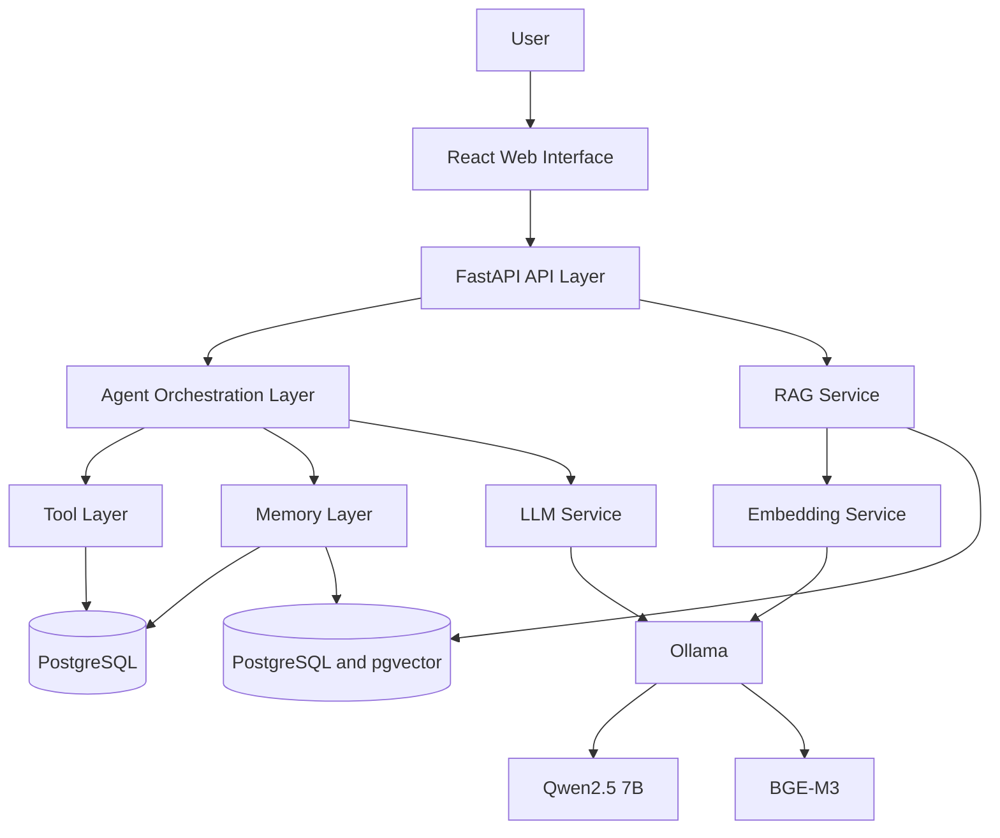
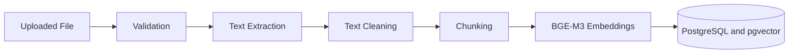
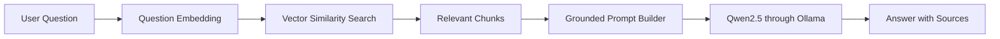
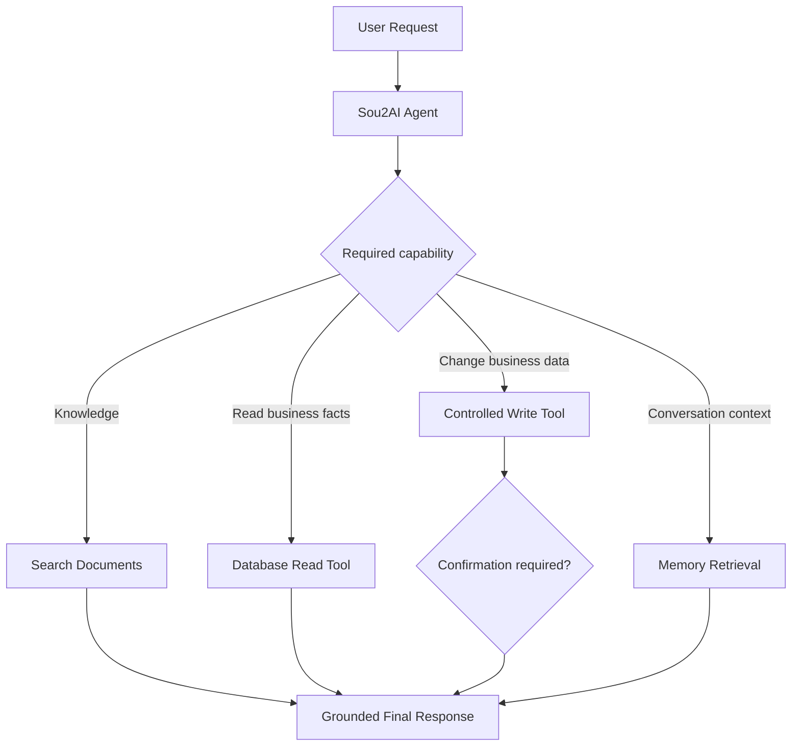
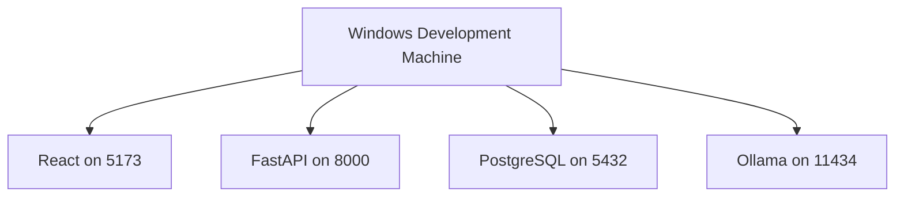

# Sou2AI architecture

## 1. Architecture goals

* Local-first development
* Clear module separation
* Replaceable model provider
* Grounded answers
* Safe tool execution
* Multilingual support
* Incremental development
* Future cloud portability

## 2. High-level architecture



During early milestones, the agent layer may not be active and the API can call the RAG service directly.

## 3. Runtime components

* React frontend provides the future browser interface.
* FastAPI backend exposes HTTP APIs and coordinates application services.
* PostgreSQL will hold structured business data and application metadata.
* pgvector will support vector similarity search in PostgreSQL.
* Ollama will run local models.
* Qwen2.5 7B will provide chat generation.
* BGE-M3 will provide multilingual embeddings.
* Local document storage will retain uploaded source files.

## 4. Backend module responsibilities

```text
app/api/       HTTP routing and API organization
app/api/v1/    version 1 routes and router
app/core/      configuration, logging, and shared exceptions
app/database/  persistence infrastructure
app/rag/       document ingestion and retrieval
app/agent/     capability selection and orchestration
app/tools/     controlled operations available to the agent
app/memory/    conversation and semantic memory
app/services/  application logic
app/schemas/   Pydantic request and response schemas
app/utils/     small shared utilities
```

Routes handle HTTP concerns. Services handle application logic. Database modules manage persistence. RAG modules manage ingestion and retrieval. Agent modules decide which capabilities to use. Tools expose controlled operations. Memory modules store and retrieve conversation or semantic memory.

## 5. API structure

`/` is an unversioned service-metadata endpoint.

`/api/v1/health` reports API health status.

All future business APIs will be placed under `/api/v1`.

## 6. RAG ingestion flow



Stored metadata will include document ID, original filename, file type, chunk index, page number when available, document category, and upload timestamp.

## 7. RAG query flow



The system must state that information is unavailable when retrieval does not provide sufficient context.

## 8. Structured data versus unstructured data

Structured PostgreSQL data will include products, prices, inventory, customers, orders, payments, and sales. Unstructured RAG data will include policies, product descriptions, warranty documents, supplier documents, FAQs, and business notes. Future questions may combine both sources.

## 9. Agent flow



Write and destructive tools must require validation and, when appropriate, explicit user confirmation.

## 10. Language handling

Sou2AI is planned to support English, Arabic, Lebanese Arabic, Franco-Arabic, and mixed-language input. Qwen2.5 generates and understands responses, while BGE-M3 handles multilingual semantic retrieval. A Franco-Arabic normalization layer may be added only if testing shows it improves retrieval. The system should respond in the user's language style when practical.

## 11. Reliability rules

* Do not fabricate prices, inventory, customers, orders, or policies.
* Do not claim a write action without a successful tool response.
* Return sources with document-grounded answers.
* Apply a similarity threshold to retrieval.
* Separate confirmed facts from recommendations.
* Log tool calls and errors.
* Do not expose internal exception details in production.

## 12. Local deployment

```text
React: 5173
FastAPI: 8000
PostgreSQL: 5432
Ollama: 11434
```



## 13. Future deployment

React may be hosted separately, FastAPI may run on a cloud server, and PostgreSQL may become managed. Ollama may be replaced by a hosted inference provider or GPU server. A provider interface should allow changing the LLM without rewriting the application. WhatsApp is a future input channel, not the core system.

## 14. Current implementation boundary

Currently, the repository contains only the FastAPI foundation: configuration, logging, CORS preparation, exception handlers, service metadata, and a versioned health endpoint. Database persistence, model connectivity, RAG, agent orchestration, memory, document ingestion, and frontend functionality remain future work.
