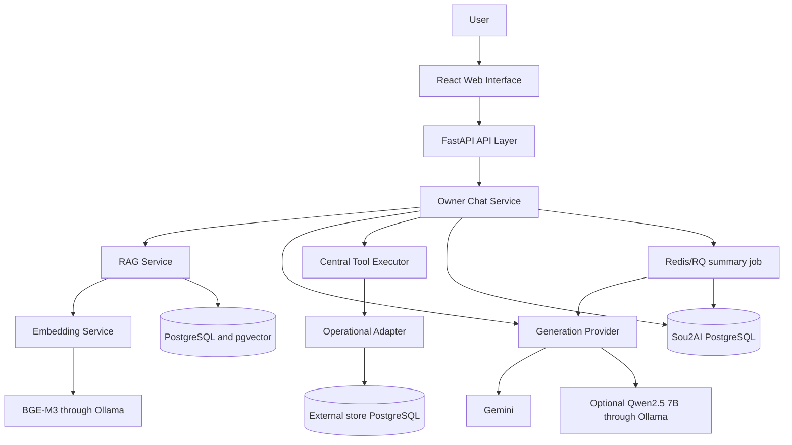
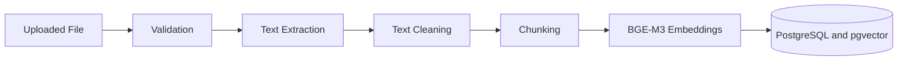
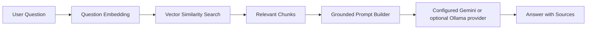
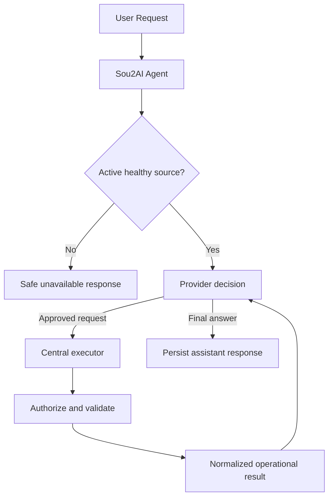
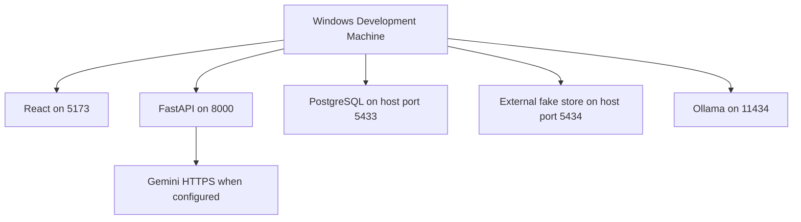

# Sou2AI architecture

## 1. Architecture goals

* Local-first development
* Clear module separation
* Replaceable model provider
* Grounded answers
* Safe tool execution
* Multilingual support
* Incremental development
* Future cloud portability

## 2. High-level architecture



Milestone 16 adds authenticated management routes for tenant-owned, non-secret
connection metadata and a Data Sources UI. Milestone 17 connects exactly four
approved read operations to owner chat through a bounded provider-neutral loop and
one centralized executor; it adds no write tools or public query endpoint.

## 3. Runtime components

* React and Vite provide the implemented browser interface.
* FastAPI backend exposes HTTP APIs and coordinates application services.
* PostgreSQL holds platform-owned identity, business-profile, schedule, owner-chat,
  learned-knowledge, document/chunk, citation, and audit metadata. It does not
  mirror live operational business data.
* pgvector stores BGE-M3 vectors and supports tenant-filtered cosine retrieval.
* Ollama provides local BGE-M3 embeddings and optional Qwen2.5 7B generation.
* Gemini is the implemented cloud generation provider used for grounded-chat
  development evaluation; deterministic mock remains available for offline tests.
* Private local document storage retains uploaded source files; Redis/RQ performs
  document processing and asynchronous rolling conversation summaries.

## 4. Backend module responsibilities

```text
app/api/       HTTP routing and API organization
app/api/v1/    version 1 routes and router
app/core/      configuration, logging, and shared exceptions
app/database/  persistence infrastructure
app/rag/       document ingestion and retrieval
app/agent/     model-provider contracts and adapters
app/integrations/ provider-neutral operational contracts and source adapters
app/tools/     fixed tool registry and centralized operational executor
app/worker/    isolated document and rolling-summary RQ jobs
app/services/  application logic
app/schemas/   Pydantic request and response schemas
app/utils/     small shared utilities
```

Routes handle HTTP concerns. Services handle application logic. Database modules
manage persistence. RAG modules manage ingestion and retrieval. The agent module
keeps provider-specific formats behind the provider-neutral owner-chat contract;
the tools module owns approved operation lookup and execution.

## 5. API structure

`/` is an unversioned service-metadata endpoint.

`/api/v1/health` reports API health status.

Business, authentication, document, owner-chat, citation, usage, and operational
data-source management APIs are under `/api/v1`.

## 6. RAG ingestion flow



Stored metadata includes document ID, original filename, file type, chunk index,
page number when available, document category, and upload timestamp.

## 7. RAG query flow



The owner-chat service authorizes the business before tenant-filtered retrieval,
combines retrieved chunks with trusted profile facts, validates returned citation
labels against supplied sources, and atomically persists the assistant message and
its citation snapshots. It states naturally that information is unavailable when
trusted context does not support an answer.

General multilingual concept expansion improves retrieval for Arabic, Lebanese
Arabic, Franco-Arabic, and mixed questions while the provider still receives the
user's original text. If authorized relevant sources materially disagree on a
value or polarity, the final answer must identify the conflict, ask for
clarification, and cite exactly every involved source; ordinary complementary
sources do not trigger that path.

Owner chat routes each claimed turn in a fixed order: controlled live operations;
clearly business-related questions, which use tenant-scoped trusted profile and
retrieval evidence or the localized missing-information fallback; then casual or
general conversation. Conversational turns use one provider call through the same
provider-neutral boundary in a context-isolated mode with no retrieval, embeddings,
business profile payload, knowledge, sources, citations, or permission to invent
business or live operational facts. The structured conversational result can signal
that business knowledge is actually required; orchestration then discards its reply
and persists the deterministic localized missing-information fallback.

For a recognized operational question, owner chat first requires an authenticated
full-access member, an `ACTIVE` business, a configured `ACTIVE` source, a healthy
mapping, and a nonblank server-side audit HMAC secret. If any prerequisite is
missing, the existing localized unavailable response is persisted without a
provider call, tool audit, rate admission, reservation, or charge. Otherwise the
provider receives only fixed tool descriptions and strict schemas. It may return a
final response, request one approved structured tool, or report the capability
unavailable; names and arguments are always validated outside the model.

## 8. Platform data versus operational business data

Sou2AI PostgreSQL stores data the platform owns: users, business profiles,
memberships, weekly opening hours, owner chat, learned stable facts, and minimal
tool-call audit metadata. Products,
inventory, orders, sales, revenue, customers, appointments, and billing remain in
the business's source system. The Milestone 16 PostgreSQL adapter proves a
read-only integration boundary against a separate demonstration source. The
platform persists only tenant-owned profile keys and lifecycle metadata. The
controlled tool layer uses only this provider-neutral boundary and normalized
contracts; it does not import or understand source tables or PostgreSQL SQL.
This avoids stale copies and preserves the business's source of truth.

Operational callers receive strict Sou2AI contracts rather than source table or
column names. The implemented operations are fixed inventory, sales-summary,
best-seller, restocking, and health queries. They use parameterized SQL, bounded
dates and rows, source-local half-open date windows, explicit final-sale/refund
semantics, statement timeouts, safe errors, and a dedicated unprivileged login.
Product-scoped inventory and restocking first resolve an exact internal/external
ID, SKU, barcode, normalized name, or approved external-catalogue alias in that
order, then consider only bounded partial name/alias candidates. The normalized
result is explicitly `resolved`, `ambiguous`, or `not_found`; ambiguous candidates
contain only safe product identifiers and can never trigger an arbitrary stock
query. Once resolved, reads use the stable external product ID and preserve each
branch or warehouse row separately. Aliases remain in the source catalogue and
are never copied into the platform database.
Active unexpired reservations reduce available stock. Restocking recommends the
trusted arithmetic difference between target and available stock only when
available stock is at or below the reorder point. No model, route, or tool can
submit SQL, inspect the source schema, or receive its credentials.

The public management API accepts only the allowlisted connection profile key and
versioned mapping profile key. The environment-backed registry resolves the safe
key to credentials inside the process and can later be replaced by a secret
manager without changing the API. Mapping validation covers completed/excluded
sale statuses, refunds, active reservations, location meaning, quantities,
revenue, currency, timezone, and required capabilities before activation.

The `operational_data_sources` platform table contains no operational records or
secrets. Its tenant foreign key, immutable scope/profile trigger, constrained
lifecycle, runtime column grants, and partial unique active-source index enforce
ownership and race-safe activation. External health checks occur before taking the
final platform row lock; the service rejects an update if configuration changed in
the meantime. Management states are `CONFIGURED`, `VALIDATED`, `ACTIVE`,
`UNHEALTHY`, and `DISABLED`.

Unstructured RAG data is stored separately and covers approved documents such as
policies, descriptions, warranties, FAQs, and business notes.

Owner chat detects requests for current inventory, sales, revenue, best sellers,
and restocking before retrieval. An active healthy source enables the four
approved reads; unsupported orders, appointments, unavailable capabilities, and
missing/unhealthy sources retain the localized live-data-unavailable reply with no
citations, provider request, AI-token reservation, or charge, even if a document
or previous message appears to contain a value.

## 9. Controlled operational agent flow



The registry contains only `current_inventory`, `sales_summary`,
`best_selling_products`, and `restocking_recommendations`. A turn permits at most
two executions and three provider calls, rejects an identical repeated request,
and treats returned records as untrusted data rather than instructions. Current
operational data takes precedence over history, documents, profile text, and model
assumptions and produces no document citations. Write and destructive tools remain
unimplemented future work and would require a separate confirmation design.
Every operational adapter declares the cancellable query timeout it enforces
internally. The centralized executor rejects adapters whose declaration exceeds
the tool bound and retains an elapsed-time check as defense in depth. PostgreSQL
enforces cancellation with `statement_timeout`; future database or HTTP adapters
must provide their own cancellable timeout before validation and activation.

## 10. Language handling

Owner chat accepts English, Arabic, Lebanese Arabic, Franco-Arabic, and
mixed-language input. Gemini and Ollama are instructed to reply in the owner's
current language and style; the deterministic mock does not claim production
language quality.

## 11. Reliability rules

* Do not fabricate prices, inventory, customers, orders, or policies.
* Do not claim a write action without a successful tool response.
* Return sources with document-grounded answers.
* Apply a similarity threshold to retrieval.
* Separate confirmed facts from recommendations.
* Log tool calls and errors.
* Do not expose internal exception details in production.

## 12. PostgreSQL business platform

The Milestone 2 tables are:

* `users`: platform accounts with normalized, case-insensitively unique email.
* `businesses`: independently onboarded profiles with immutable creator ownership,
  authoritative `PENDING`, `ACTIVE`, or `DISABLED` lifecycle status, and the first
  successful onboarding-confirmation timestamp. API `is_active` is derived from
  `status = ACTIVE` and is not stored.
* `business_lifecycle_history`: permanent internal append-only records of every
  successful lifecycle transition, operator identifier, written reason, and time.
* `business_memberships`: the tenant access relationship. Creation atomically adds
  the creator with the only MVP permission, `FULL_ACCESS`.
* `business_opening_days`: one row per business weekday, with Monday `0` through
  Sunday `6`.
* `business_opening_shifts`: one to three chronological same-day local wall-clock
  intervals per open day. Adjacent intervals remain separate; overnight,
  duplicate, and overlapping intervals are rejected.
* `tool_call_logs`: business-scoped audit metadata only.

Profile completion is calculated, never accepted from a client or stored. It
requires a 2-120 character name, 20-2,000 character description, approved category
(`OTHER` requires a 2-100 character custom value), an approved Lebanese
governorate/district/city combination, a 5-255 character address, and exactly seven
valid opening-day records. A closed day has no shifts; an open day has one to three.
Completion and confirmation never activate a business.

### 12.1 Business lifecycle

`public.sou2ai_change_business_status(uuid, business_status, text, text)` is the
only supported lifecycle write path. It locks the business row; trims and bounds
the required operator identifier and reason; permits only `PENDING -> ACTIVE`,
`ACTIVE -> DISABLED`, and `DISABLED -> ACTIVE`; and atomically changes status and
inserts exactly one history row. Activation and re-enabling reuse the authoritative
database profile-completion function and also require `onboarding_submitted_at`.

PostgreSQL privilege separation is the authorization boundary. The trusted local
Docker bootstrap login runs Alembic, while the `NOLOGIN` `sou2ai_migrator` role owns
the protected tables, enum, triggers, and `SECURITY DEFINER` lifecycle function.
FastAPI connects through a non-superuser login that inherits only
`sou2ai_runtime`; its column-level business update grant excludes `status`, it has
no lifecycle-history mutation grants, and it cannot execute the lifecycle
function. The SQLAlchemy connection setup also fails closed if FastAPI is pointed
at a superuser, migrator, or operator role. A separate non-superuser operator login
inherits only `sou2ai_lifecycle_operator`, which can execute the function but
cannot update the table or mutate history directly. The function is fully
qualified, has fixed `search_path = pg_catalog`, and is not executable by `PUBLIC`.
Schema creation is also revoked from runtime, operator, and `PUBLIC`, preventing
function replacement.
Former custom lifecycle GUCs are not authorization controls and are no longer used.

A trigger still rejects non-pending inserts, and append-only triggers provide
defense in depth against history updates, deletes, and truncation. Privileges deny
ordinary history inserts. History references businesses with `ON DELETE RESTRICT`,
matching permanent audit integrity: a business with lifecycle history cannot be
deleted unless project policy is deliberately changed in a future migration.
Owner-facing APIs expose status and derived activity only, never audit operators or
reasons. Pending and disabled businesses cannot use owner chat or future paid AI
capabilities. PostgreSQL superusers remain trusted bootstrap administrators and
cannot be restricted by database ACLs. No admin HTTP endpoint, application admin
role, or dashboard exists.

Business names trim outer whitespace, collapse internal whitespace, and compare
case-insensitively while preserving punctuation. Immutable `owner_user_id` supports
the database unique key `(owner_user_id, normalized_name)`; memberships remain the
only access-control relationship. Different owners may use the same name.

Schedule replacement validates the complete proposal first and writes all seven
days in one transaction. Business creation and creator membership also commit as
one transaction. Business PATCH and confirmation lock the business row, giving
simple last-write-wins semantics for simultaneous valid edits. Constraints and
transactions, rather than process-local state, keep these operations safe when the
one-replica MVP is scaled to multiple replicas.

## 13. Minimal tool-call auditing

The audit table stores only tool name, business/user scope, outcome, machine error
code, latency, timestamp, and an HMAC-SHA-256 digest of deterministic canonical
JSON arguments. It never stores raw arguments, return payloads, prompts,
responses, reasoning, conversation text, customer PII, raw errors, or stack
traces. Retention defaults to 90 days and is configurable; a reusable deletion
operation is intended for a future external scheduler. No internal scheduler or
`pg_cron` is used.

## 13.1 User authentication

Authentication identifies a platform user and is deliberately independent from
business membership or tenant authorization. Passwords use Argon2 hashes. Email
verification and password-reset links carry single-use opaque tokens whose
SHA-256 digests, expiration, and consumption state are stored in PostgreSQL.

Access tokens are signed, short-lived JWTs with minimal identity claims. Each
login creates an independent refresh-session family. Opaque refresh tokens are
delivered only through an environment-configured HttpOnly cookie, stored only as
digests, and rotated under a row lock. Reuse revokes the remaining family. Logout
can revoke one family or every active session for a user.

Login failures, verification resends, and password-reset requests use persistent
PostgreSQL event counters scoped by normalized email and trusted client address.
Forwarded addresses are ignored unless trusted-proxy handling is explicitly
enabled. Transaction advisory locks serialize each rate-limit scope across API
processes. Transactional email is isolated behind a provider boundary implemented
with Resend.

Authentication events contain a normalized email address, client IP address,
event type, and timestamp only for temporary abuse-control decisions. The longest
current decision window is one hour, so retention defaults to 24 hours and is
enforced at a minimum of two hours. Login, verification-resend, and password-reset
requests opportunistically remove one bounded batch of expired rows. A persistent
PostgreSQL maintenance-task row throttles attempts to once per configured interval
(60 minutes by default) across processes, instances, and restarts. A nonblocking
transaction advisory lock and atomic due-time claim coordinate workers. The claim
advances before deletion so a failed attempt cannot cause retries on every request;
maintenance failure does not change the authentication response or its counters.
An external database maintenance job may replace or supplement this mechanism if
future volume requires it.

## 13.2 Owner chat and learned business knowledge

Every business is bootstrapped with one private `owner_web` conversation and may
own multiple conversations. Each stores its immutable business/creator/channel
scope, deterministic first-message title, next turn, activity time, and archived
state. Archived conversations remain readable but cannot receive messages. Owner
turns reserve odd logical sequence numbers and assistant replies use the following
even number. Conversation and message lists use bounded stable cursor pages.

Idempotency keys are unique per conversation in PostgreSQL. Identical completed
replays reuse the owner message and stored reply; a changed payload conflicts. A
failed generation is terminal for that idempotency key and never creates a fake
reply or calls the provider again. A deliberate new message uses a new key.

Replica-safe processing uses persisted generation state and expiring claim tokens.
A short transaction locks the conversation and claims only the exact owner message
created or reused by the request. An active claim rejects a different new turn as
conversation-busy before it can create pending backlog. Expired claims and bounded
batches of old never-claimed pending turns are marked failed under row locks; they
are never generated by a later unrelated request. Failed and unanswered owner
messages remain in history but are excluded from provider context. Assistant
persistence, accepted knowledge upserts, and completion commit atomically.
Different conversations do not block one another. Sticky sessions and
process-local locks are not used for interactive generation; Redis/RQ is used only
after a completed response to advance rolling memory asynchronously.

One tenant-scoped summary row checkpoints each conversation. A lease and row lock
allow only one worker to claim the next ordered batch. Only completed
owner/assistant boundaries are eligible; the newest six complete turns (12
messages) remain verbatim. Failed, stale, abandoned, pending, and incomplete turns
are excluded. The provider receives the latest valid summary, up to 12 eligible
messages after its checkpoint, and the current owner message. Original messages
are immutable retention records and are never deleted or rewritten by summary
work. Failure clears only the claim and preserves the last valid summary.

Summarization has a provider-neutral bounded request/result contract and never
uses RAG or operational tools. Its inputs are untrusted and exclude credentials,
system prompts, hidden IDs, tool arguments, and audit data. Each attempt uses a
separate `conversation_summary` AI reservation from the business shared allowance;
the owner turn reservation is independent. Live tool results, current profile,
authorized RAG evidence, and the current message always outrank verbatim memory,
rolling summaries, and previous assistant claims.

The provider boundary accepts a provider-neutral mode plus ordered messages and
request time. Grounded mode also carries the business profile, all seven working
days and ordered local-time shifts, bounded active knowledge, and retrieved sources;
it returns a reply, proposed facts, and citation labels. Conversation mode omits
that business context and returns a reply plus a boolean business-knowledge signal.
The deterministic offline mock remains the default.
The optional local Ollama implementation sends one non-streaming `/api/chat`
request to configurable `qwen2.5:7b`, validates its JSON-schema response, and maps
timeouts, missing models, unavailability, HTTP failures, and invalid output to the
same safe provider errors. Routes, orchestration, and persistence remain
provider-neutral. Backend startup performs no provider probe.

The Gemini REST provider sends one non-streaming structured-generation request,
keeps its API key in the request header, excludes hidden thinking from the parsed
answer, and normalizes authentication, transport, timeout, rate-limit, blocked,
truncated, malformed, and invalid-schema responses. Neither provider retries or
falls back automatically. Owner-facing errors safely distinguish rate limiting,
timeouts, transport failures, and unusable responses without naming a provider or
exposing payloads, URLs, credentials, or internal exceptions.

For grounded turns, retrieval re-authorizes `FULL_ACCESS` to the active business
and filters candidates by the same `business_id`, ready document state, and active
embedding model. Retrieved document text is untrusted data: clear prompt-injection
content is excluded, the generation prompt forbids following source instructions,
and unsafe outputs are rejected. Only unique labels from the supplied source set
can be persisted. PostgreSQL additionally verifies that each citation's assistant
message, document, and chunk belong to the same business. Assistant content,
citations, learned owner facts, generation completion, and usage reconciliation
commit atomically.

Before admission, each provider deterministically estimates the complete canonical
serialized input it will send, including instructions, JSON structure/schema,
profile, all schedule shifts, knowledge metadata, message roles, request time, and
escaping. Ollama and its non-authoritative post-response fallback use the same
one-token-per-three-UTF-8-bytes path, so fallback input cannot exceed the amount
estimated from that request representation. This serialization is neither stored
nor logged.

Ollama calls use a 120-second default timeout. The persisted generation lease
defaults to 150 seconds and must exceed the Ollama timeout, so another replica
cannot reclaim a turn while the first provider call is still within its deadline.
Automated tests use mocked HTTP transports and never call the local service.

`business_knowledge` stores a tenant-unique normalized subject, content, allowed
category, owner-chat provenance, lifecycle, expiry, and timestamps. Permanent
facts have no expiry; temporary facts require one. PostgreSQL filters expired facts
before context selection, which is bounded by
`OWNER_CHAT_KNOWLEDGE_CONTEXT_LIMIT`. Expired rows remain owner-manageable.
Duplicate subjects update without changing `created_at`.

Learned knowledge is separate from conversation history and ingested RAG documents.
Application allowlists reject current stock, revenue, orders, sales totals, best
sellers, restocking quantities, appointment availability, and other changing
operational data. Future concepts such as `get_revenue_trend`,
`get_top_selling_items`, and `compare_sales` will use controlled tenant-scoped live
adapters; they are not implemented and the model must not guess their results.

The centralized tool-execution service—not the model, provider adapter, or source
adapter—writes exactly one audit row after business-scope and permission checks for
each attempted success, error, denial, or timeout. It stores only business/user
scope, stable tool name, HMAC argument digest, status, safe error code, non-negative
latency, and timestamp. Audit persistence must succeed before execution can be
reported as successfully audited; raw arguments and results are never stored.

## 13.3 Knowledge-document storage

Knowledge documents are owned by one business and are separate from
`business_knowledge`, business-profile facts, and chat history. PostgreSQL stores
safe metadata and provider-neutral storage keys only; file bytes remain outside the
database. Private local development storage, secure PDF/DOCX/TXT ingestion,
bounded extraction, deterministic chunking, and Redis/RQ processing are
implemented. Private S3 remains a future production storage provider.

Each chunk carries the owning `business_id` and references its document through a
same-business composite foreign key. Embeddings are nullable `vector(1024)` values.
Milestone 13 creates them through a provider-neutral local Ollama BGE-M3 adapter,
validates every result, and writes all chunks/vectors atomically before marking a
document `READY`. Internal exact cosine retrieval always filters by authorized
business, `READY` documents, and the configured embedding model. It has no public
endpoint; owner chat uses it internally for grounded answer generation.
Re-embedding uses the same RQ queue and only replaces a complete valid vector set,
retaining the prior set on failure.

## 13.4 API security and AI usage control

Every HTTP request receives a server-generated UUID returned as `X-Request-ID`,
included in every error, and attached to privacy-safe internal logs. The outer
ASGI security middleware validates the host, consumes the current non-upload
request stream only up to 65,536 bytes, applies global `no-store` and browser
hardening headers, and logs only the method, route template, status, duration,
safe client address, and request ID. Production logging is newline JSON;
development is readable and testing is quiet. A central filter redacts sensitive
field names, bearer/JWT shapes, and database URLs as defense in depth. Unexpected
errors are generic in every environment.

Forwarded client addresses are ignored unless the direct peer is in
`TRUSTED_PROXY_CIDRS`. Valid IPv4/IPv6 hops are walked from the nearest proxy
backward; malformed chains fall back to the direct peer. Trusted hosts and CORS
origins are trimmed and structurally normalized. Production rejects wildcard or
case/representation-independent loopback hosts and origins, and CORS rejects
userinfo, non-root paths, queries, fragments, and non-HTTP(S) schemes. Production
disables API documentation by default and emits HSTS only when trusted HTTPS
termination is explicitly configured.

Registration and owner-generation counters are privacy-minimal PostgreSQL rows.
Sorted transaction advisory locks serialize registration email/IP scopes; one
business advisory-lock scope serializes owner burst admission. Registration
permits five attempts per normalized email/hour, 30 per client IP/15 minutes, and
100 per client IP/24 hours. Owner generation permits three attempts/business/minute
and 20/business/hour. Registration admission happens before password hashing or
email delivery. Owner-generation admission happens only after deterministic
live-data-unavailable and missing-evidence routing, immediately before any grounded
or conversational provider-backed reservation and call. Blocked or failed
idempotent replays reuse one terminal owner message and create no assistant,
provider call, duplicate rate event, or token charge.

The restricted runtime cannot directly select or mutate rate-event tables.
Fixed-search-path, migrator-owned security-definer functions perform admission
with the PostgreSQL clock. A separate narrowly verified undo can remove only the
current message attempt when token reservation failed and no reservation exists;
it cannot delete other or historical events.

`business_ai_allowance_configs` gives every business 20,000 tokens per local day
and protects 25% for owner traffic. A trigger creates the default for new
businesses and the migration backfills existing businesses without historical
usage. Local windows use the stored IANA timezone and follow Beirut DST.
`business_ai_usage_daily` is the locked serialization point for completed and
reserved usage. `ai_usage_reservations` reserves estimated input plus the
configured 512-token maximum output before generation for 150 seconds. Completion
atomically persists the assistant and reconciles authoritative counts or the
conservative one-token-per-three-UTF-8-bytes estimate. Known pre-use failures
such as a missing model or connection refusal before dispatch release; timeouts,
read/write/protocol/reset failures, generic HTTP 5xx responses, invalid responses,
and other ambiguous post-dispatch failures charge the full reservation. Reported
authoritative usage is captured before response validation and charged instead of
the reservation. Idempotent completed turns never reserve twice.

Owner traffic may use shared tokens plus the owner reserve. The schema identifies
channel and applies only the shared portion to future customer and WhatsApp
channels, but those channels are not implemented. Authenticated
`GET /api/v1/businesses/{business_id}/ai-usage/current` requires current
`FULL_ACCESS` membership and returns only counters, local window/reset, allowance,
reserve, remaining percentage, and threshold status.
Availability percentage and threshold status use completed plus currently
reserved tokens, while completed input/output/total counters remain separate;
remaining tokens are clamped at zero and authoritative overage may exceed 100%.

Allowance changes use only
`public.sou2ai_change_business_ai_allowance(uuid, integer, integer, text, text)`.
The `sou2ai_migrator` owner executes fully qualified writes through a fixed
`pg_catalog` search path; `PUBLIC` and FastAPI cannot execute it; only the existing
restricted lifecycle operator can. Runtime and operator roles cannot directly
change configurations or mutate permanent append-only allowance audit history.
PostgreSQL superusers remain trusted bootstrap administrators.

PostgreSQL-coordinated best-effort maintenance retains owner burst events for 24
hours, registration events for 48 hours, detailed reservations for 90 days, and
daily summaries for 12 months. It first charges expired uncertain reservations,
uses a persistent shared maintenance claim, takes its cutoff only from
`clock_timestamp()`, caps each batch at 1,000, and adds no scheduler, Redis, or
queue. Runtime can execute the controlled cleanup but cannot mutate the underlying
tables or supply a timestamp. Accounting records never contain prompts, messages,
answers, bodies, raw provider payloads, reasoning, authorization data, or costs.

## 14. Local deployment

```text
React: 5173
FastAPI: 8000
PostgreSQL host port: 5433 (container port: 5432)
External fake-store PostgreSQL host port: 5434 (container port: 5432)
Ollama: 11434
```



Docker Compose persists `sou2ai_dev` in a named volume and creates isolated
`sou2ai_test` automatically. Its initialization also provisions distinct local
runtime and lifecycle-operator logins backed by `NOLOGIN` privilege roles. Alembic
uses a separate bootstrap URL; FastAPI uses only the restricted runtime URL. Tests
reject any database name other than `sou2ai_test` and exercise lifecycle attacks
and budget controls through the real non-superuser logins. `GET
/api/v1/health/database` performs
`SELECT 1` and returns only `healthy` or `unavailable` without connection details.

The separate `fake-store-postgres` service owns only the `fake_store` database and
persists it in its own named volume. Its `minimarket` schema contains deterministic
catalog, branch/warehouse stock, reservations, receipts, lines, and refunds. The
adapter login can connect and select only required source tables; it cannot mutate
data, create objects, alter schemas, use temporary storage, or read the private
fixture schema. This database is an external demonstration system and has no
Sou2AI platform tables or Alembic migrations.

## 15. Model-provider boundary and future deployment

React may be hosted separately, FastAPI may run on a cloud server, and PostgreSQL
may become managed. Gemini and optional local Ollama generation are both
implemented behind the same provider abstraction, so database and domain code do
not depend on one model. Gemini is used for development evaluation; production
provider approval and deployment remain future work. WhatsApp is a future input
channel, not the core system.

## 16. Current implementation boundary

The repository contains the FastAPI/PostgreSQL platform foundation, user
authentication, multi-business management, tenant-scoped authorization, resumable
onboarding, database-controlled business lifecycle history, multiple retained
private owner conversations, asynchronous rolling memory, ordered persistent owner
chat, deterministic mock, Gemini, and
optional local Ollama generation providers, managed permanent/temporary learned
knowledge, pgvector/BGE-M3 retrieval, private document ingestion and processing,
grounded answers with persisted citations, PostgreSQL-backed API limits and AI
budgets, the HTTP/logging security boundary, the React business interface, and
Milestone 16's provider-neutral contracts, fake-store PostgreSQL adapter,
tenant-scoped lifecycle API, and responsive Data Sources UI, plus Milestone 17's
four-tool read-only registry, centralized executor, bounded owner-chat loop, and
privacy-minimal tool auditing. Customer chat, WhatsApp, operational writes,
billing, and activation/admin APIs remain future work.

## 17. Milestone 12 document ingestion

An authenticated full-access member of an `ACTIVE` business submits a PDF, DOCX,
or UTF-8 TXT source document to the API. The API streams it into a temporary file
while calculating SHA-256, validates content and resource limits, writes private
local storage atomically under a generated provider-neutral key, commits metadata,
then sends only the document ID to Redis/RQ. The worker independently claims the
tenant document, extracts and normalizes text locally, writes ordered chunks, and
marks it `READY`; safe failures become `FAILED`. Source bytes and chunks are never
public. The local storage interface is intentionally the future S3 boundary.
