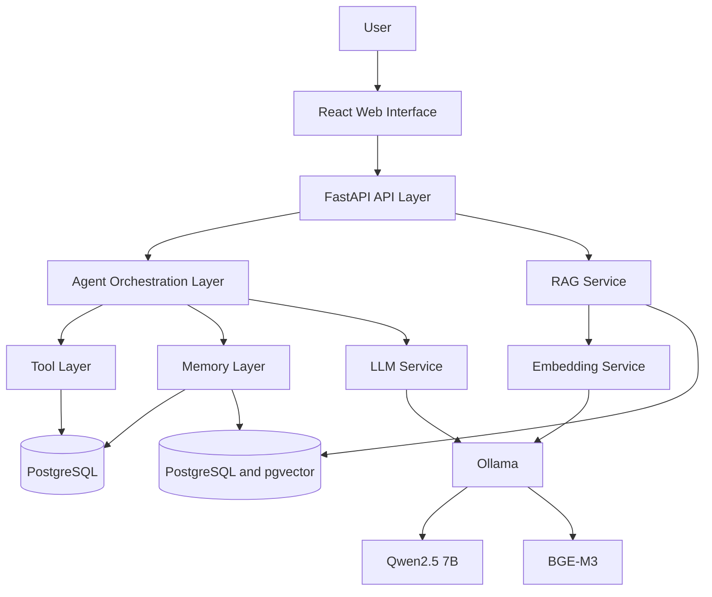
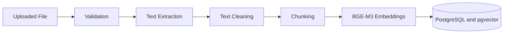
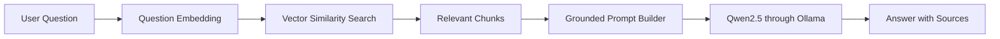
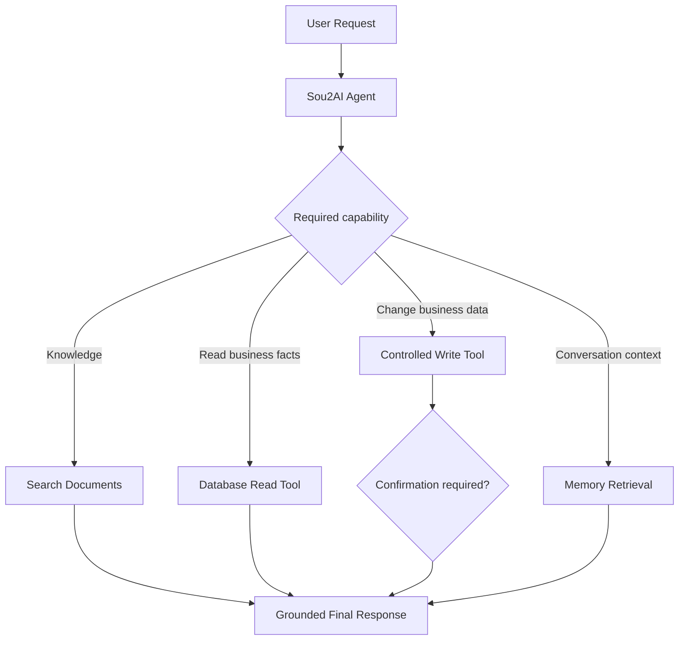
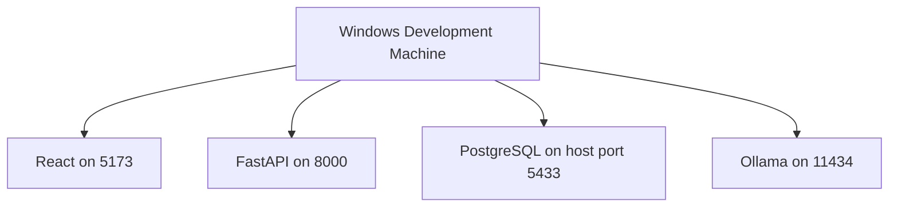

# Sou2AI architecture

## 1. Architecture goals

* Local-first development
* Clear module separation
* Replaceable model provider
* Grounded answers
* Safe tool execution
* Multilingual support
* Incremental development
* Future cloud portability

## 2. High-level architecture



During early milestones, the agent layer may not be active and the API can call the RAG service directly.

## 3. Runtime components

* React frontend provides the future browser interface.
* FastAPI backend exposes HTTP APIs and coordinates application services.
* PostgreSQL holds platform-owned identity, business-profile, schedule, owner-chat,
  learned-knowledge, and audit metadata. It does not mirror live operational
  business data.
* pgvector will support vector similarity search in PostgreSQL.
* Ollama will run local models.
* Qwen2.5 7B will provide chat generation.
* BGE-M3 will provide multilingual embeddings.
* Local document storage will retain uploaded source files.

## 4. Backend module responsibilities

```text
app/api/       HTTP routing and API organization
app/api/v1/    version 1 routes and router
app/core/      configuration, logging, and shared exceptions
app/database/  persistence infrastructure
app/rag/       document ingestion and retrieval
app/agent/     capability selection and orchestration
app/tools/     controlled operations available to the agent
app/memory/    conversation and semantic memory
app/services/  application logic
app/schemas/   Pydantic request and response schemas
app/utils/     small shared utilities
```

Routes handle HTTP concerns. Services handle application logic. Database modules manage persistence. RAG modules manage ingestion and retrieval. Agent modules decide which capabilities to use. Tools expose controlled operations. Memory modules store and retrieve conversation or semantic memory.

## 5. API structure

`/` is an unversioned service-metadata endpoint.

`/api/v1/health` reports API health status.

All future business APIs will be placed under `/api/v1`.

## 6. RAG ingestion flow



Stored metadata will include document ID, original filename, file type, chunk index, page number when available, document category, and upload timestamp.

## 7. RAG query flow



The system must state that information is unavailable when retrieval does not provide sufficient context.

## 8. Platform data versus operational business data

Sou2AI PostgreSQL stores data the platform owns: users, business profiles,
memberships, weekly opening hours, owner chat, learned stable facts, and minimal
tool-call audit metadata. Products,
inventory, orders, sales, revenue, customers, appointments, and billing remain in
the business's source system. Future controlled tools will access those systems
through an API, a read-only database integration, or a Sou2AI-managed operational
system. This avoids stale copies and preserves the business's source of truth.

Unstructured RAG data remains separate and will later cover approved documents
such as policies, descriptions, warranties, FAQs, and business notes.

## 9. Agent flow



Write and destructive tools must require validation and, when appropriate, explicit user confirmation.

## 10. Language handling

Milestone 5 owner chat accepts English, Arabic, Lebanese Arabic, Franco-Arabic,
and mixed-language input while producing English owner-facing responses. Its
deterministic mock does not claim production language quality. Future provider
evaluation will determine whether normalization is useful.

## 11. Reliability rules

* Do not fabricate prices, inventory, customers, orders, or policies.
* Do not claim a write action without a successful tool response.
* Return sources with document-grounded answers.
* Apply a similarity threshold to retrieval.
* Separate confirmed facts from recommendations.
* Log tool calls and errors.
* Do not expose internal exception details in production.

## 12. PostgreSQL business platform

The Milestone 2 tables are:

* `users`: platform accounts with normalized, case-insensitively unique email.
* `businesses`: independently onboarded profiles with immutable creator ownership,
  pending state, inactive-by-default activation, and the first successful
  onboarding-confirmation timestamp.
* `business_memberships`: the tenant access relationship. Creation atomically adds
  the creator with the only MVP permission, `FULL_ACCESS`.
* `business_opening_days`: one row per business weekday, with Monday `0` through
  Sunday `6`.
* `business_opening_shifts`: one to three chronological same-day local wall-clock
  intervals per open day. Adjacent intervals remain separate; overnight,
  duplicate, and overlapping intervals are rejected.
* `tool_call_logs`: business-scoped audit metadata only.

Profile completion is calculated, never accepted from a client or stored. It
requires a 2-120 character name, 20-2,000 character description, approved category
(`OTHER` requires a 2-100 character custom value), an approved Lebanese
governorate/district/city combination, a 5-255 character address, and exactly seven
valid opening-day records. A closed day has no shifts; an open day has one to three.
Completion and confirmation never activate a business.

Business names trim outer whitespace, collapse internal whitespace, and compare
case-insensitively while preserving punctuation. Immutable `owner_user_id` supports
the database unique key `(owner_user_id, normalized_name)`; memberships remain the
only access-control relationship. Different owners may use the same name.

Schedule replacement validates the complete proposal first and writes all seven
days in one transaction. Business creation and creator membership also commit as
one transaction. Business PATCH and confirmation lock the business row, giving
simple last-write-wins semantics for simultaneous valid edits. Constraints and
transactions, rather than process-local state, keep these operations safe when the
one-replica MVP is scaled to multiple replicas.

## 13. Minimal tool-call auditing

The audit table stores only tool name, business/user scope, outcome, machine error
code, latency, timestamp, and an HMAC-SHA-256 digest of deterministic canonical
JSON arguments. It never stores raw arguments, return payloads, prompts,
responses, reasoning, conversation text, customer PII, raw errors, or stack
traces. Retention defaults to 90 days and is configurable; a reusable deletion
operation is intended for a future external scheduler. No internal scheduler or
`pg_cron` is used.

## 13.1 User authentication

Authentication identifies a platform user and is deliberately independent from
business membership or tenant authorization. Passwords use Argon2 hashes. Email
verification and password-reset links carry single-use opaque tokens whose
SHA-256 digests, expiration, and consumption state are stored in PostgreSQL.

Access tokens are signed, short-lived JWTs with minimal identity claims. Each
login creates an independent refresh-session family. Opaque refresh tokens are
delivered only through an environment-configured HttpOnly cookie, stored only as
digests, and rotated under a row lock. Reuse revokes the remaining family. Logout
can revoke one family or every active session for a user.

Login failures, verification resends, and password-reset requests use persistent
PostgreSQL event counters scoped by normalized email and trusted client address.
Forwarded addresses are ignored unless trusted-proxy handling is explicitly
enabled. Transaction advisory locks serialize each rate-limit scope across API
processes. Transactional email is isolated behind a provider boundary implemented
with Resend.

Authentication events contain a normalized email address, client IP address,
event type, and timestamp only for temporary abuse-control decisions. The longest
current decision window is one hour, so retention defaults to 24 hours and is
enforced at a minimum of two hours. Login, verification-resend, and password-reset
requests opportunistically remove one bounded batch of expired rows. A persistent
PostgreSQL maintenance-task row throttles attempts to once per configured interval
(60 minutes by default) across processes, instances, and restarts. A nonblocking
transaction advisory lock and atomic due-time claim coordinate workers. The claim
advances before deletion so a failed attempt cannot cause retries on every request;
maintenance failure does not change the authentication response or its counters.
An external database maintenance job may replace or supplement this mechanism if
future volume requires it.

## 13.2 Owner chat and learned business knowledge

Every business is created with exactly one `owner_conversations` row. Owner turns
reserve odd logical sequence numbers and assistant replies use the following even
number. History returns the newest 50 messages per stable cursor page, while the
provider receives only the newest 12 messages up to the processed turn.

Idempotency keys are unique per conversation in PostgreSQL. Identical replays
reuse the owner message and stored reply; a changed payload conflicts. A failed
generation leaves the owner message retryable and never creates a fake reply.

Replica-safe ordering uses persisted generation state and expiring claim tokens.
A short transaction locks the conversation, claims only its earliest unfinished
turn, and commits. Context is read and the connection is released before the
provider call. Another replica waits or reclaims an expired/failed claim; it cannot
advance past an unfinished earlier turn. Assistant persistence, accepted knowledge
upserts, and completion commit atomically. Different conversations do not block
one another. Redis, queues, workers, sticky sessions, and process-local locks are
not used.

The provider boundary accepts a provider-neutral business profile, bounded active
knowledge, ordered messages, and request time. It returns an English reply and
structured proposed facts. Milestone 5 supplies only a deterministic offline mock
and safe timeout, unavailable, and invalid-response errors. Cloud and Ollama
providers remain future implementations behind the same boundary.

`business_knowledge` stores a tenant-unique normalized subject, content, allowed
category, owner-chat provenance, lifecycle, expiry, and timestamps. Permanent
facts have no expiry; temporary facts require one. PostgreSQL filters expired facts
before context selection, which is bounded by
`OWNER_CHAT_KNOWLEDGE_CONTEXT_LIMIT`. Expired rows remain owner-manageable.
Duplicate subjects update without changing `created_at`.

Learned knowledge is separate from conversation history and future RAG documents.
Application allowlists reject current stock, revenue, orders, sales totals, best
sellers, restocking quantities, appointment availability, and other changing
operational data. Future concepts such as `get_revenue_trend`,
`get_top_selling_items`, and `compare_sales` will use controlled tenant-scoped live
adapters; they are not implemented and the model must not guess their results.

A future centralized tool-execution service—not the model and not individual
adapters—will write exactly one audit row after business-scope and permission
checks for every success, error, or denial. That executor and its adapters remain
out of scope.

## 14. Local deployment

```text
React: 5173
FastAPI: 8000
PostgreSQL host port: 5433 (container port: 5432)
Ollama: 11434
```



Docker Compose persists `sou2ai_dev` in a named volume and creates isolated
`sou2ai_test` automatically. Tests reject any database name other than
`sou2ai_test`. `GET /api/v1/health/database` performs `SELECT 1` and returns only
`healthy` or `unavailable` without connection details.

## 15. Model-provider boundary and future deployment

React may be hosted separately, FastAPI may run on a cloud server, and PostgreSQL
may become managed. Ollama is only the local-development and early-testing
provider. Production will use a cloud provider behind a provider abstraction, so
database and domain code must never depend on Ollama or a particular model.
WhatsApp is a future input channel, not the core system.

## 16. Current implementation boundary

The repository contains the FastAPI/PostgreSQL platform foundation, user
authentication, multi-business management, tenant-scoped authorization, resumable
onboarding, one owner conversation per business, ordered persistent owner chat, a
deterministic mock provider, and managed permanent/temporary learned knowledge.
Cloud or Ollama connectivity, pgvector, RAG, live tools and analytics, customer
chat, documents, billing, activation APIs, and frontend functionality remain
future work.
