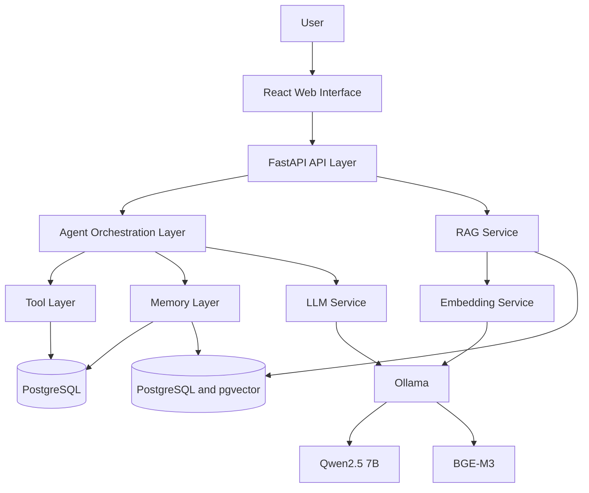
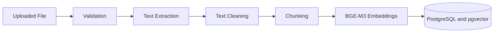
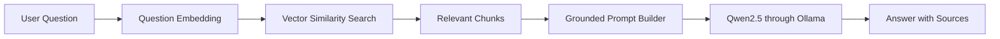
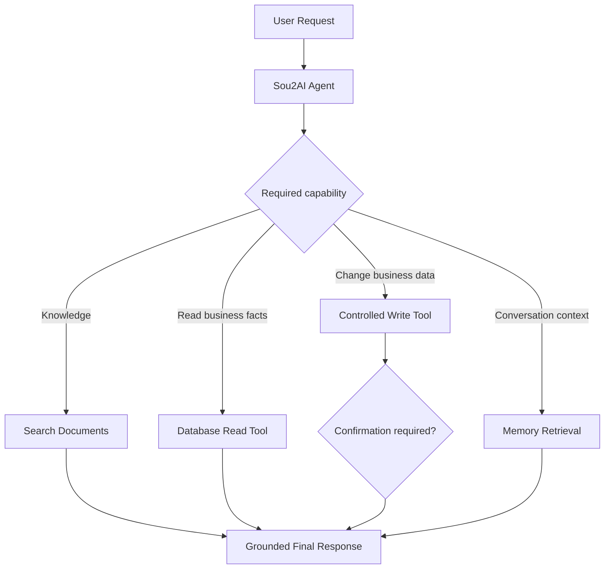
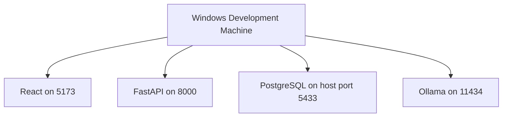

# Sou2AI architecture

## 1. Architecture goals

* Local-first development
* Clear module separation
* Replaceable model provider
* Grounded answers
* Safe tool execution
* Multilingual support
* Incremental development
* Future cloud portability

## 2. High-level architecture



During early milestones, the agent layer may not be active and the API can call the RAG service directly.

## 3. Runtime components

* React frontend provides the future browser interface.
* FastAPI backend exposes HTTP APIs and coordinates application services.
* PostgreSQL holds platform-owned identity, business-profile, schedule, and audit
  metadata. It does not mirror live operational business data.
* pgvector will support vector similarity search in PostgreSQL.
* Ollama will run local models.
* Qwen2.5 7B will provide chat generation.
* BGE-M3 will provide multilingual embeddings.
* Local document storage will retain uploaded source files.

## 4. Backend module responsibilities

```text
app/api/       HTTP routing and API organization
app/api/v1/    version 1 routes and router
app/core/      configuration, logging, and shared exceptions
app/database/  persistence infrastructure
app/rag/       document ingestion and retrieval
app/agent/     capability selection and orchestration
app/tools/     controlled operations available to the agent
app/memory/    conversation and semantic memory
app/services/  application logic
app/schemas/   Pydantic request and response schemas
app/utils/     small shared utilities
```

Routes handle HTTP concerns. Services handle application logic. Database modules manage persistence. RAG modules manage ingestion and retrieval. Agent modules decide which capabilities to use. Tools expose controlled operations. Memory modules store and retrieve conversation or semantic memory.

## 5. API structure

`/` is an unversioned service-metadata endpoint.

`/api/v1/health` reports API health status.

All future business APIs will be placed under `/api/v1`.

## 6. RAG ingestion flow



Stored metadata will include document ID, original filename, file type, chunk index, page number when available, document category, and upload timestamp.

## 7. RAG query flow



The system must state that information is unavailable when retrieval does not provide sufficient context.

## 8. Platform data versus operational business data

Sou2AI PostgreSQL stores data the platform owns: users, business profiles,
memberships, weekly opening hours, and minimal tool-call audit metadata. Products,
inventory, orders, sales, revenue, customers, appointments, and billing remain in
the business's source system. Future controlled tools will access those systems
through an API, a read-only database integration, or a Sou2AI-managed operational
system. This avoids stale copies and preserves the business's source of truth.

Unstructured RAG data remains separate and will later cover approved documents
such as policies, descriptions, warranties, FAQs, and business notes.

## 9. Agent flow



Write and destructive tools must require validation and, when appropriate, explicit user confirmation.

## 10. Language handling

Sou2AI is planned to support English, Arabic, Lebanese Arabic, Franco-Arabic, and mixed-language input. Qwen2.5 generates and understands responses, while BGE-M3 handles multilingual semantic retrieval. A Franco-Arabic normalization layer may be added only if testing shows it improves retrieval. The system should respond in the user's language style when practical.

## 11. Reliability rules

* Do not fabricate prices, inventory, customers, orders, or policies.
* Do not claim a write action without a successful tool response.
* Return sources with document-grounded answers.
* Apply a similarity threshold to retrieval.
* Separate confirmed facts from recommendations.
* Log tool calls and errors.
* Do not expose internal exception details in production.

## 12. PostgreSQL platform foundation

The Milestone 2 tables are:

* `users`: platform accounts with normalized, case-insensitively unique email.
* `businesses`: lightweight profiles, Lebanese defaults, and disabled-by-default
  activation state.
* `business_memberships`: the one-owner MVP association. Its relational shape can
  later support roles and multiple members without duplicating ownership.
* `business_opening_days`: one row per business weekday, with Monday `0` through
  Sunday `6`.
* `business_opening_shifts`: one to three local wall-clock intervals per open day.
  A closing time before opening crosses midnight. Touching proposed intervals are
  merged; overlaps are rejected.
* `tool_call_logs`: business-scoped audit metadata only.

Profile completion is calculated, never stored. It requires all profile text, a
valid default language, seven days, no shifts on closed days, and one to three
valid normalized shifts on open days. PostgreSQL rejects a disabled-to-active
transition when these rules are not met. The platform owner may activate a
complete business directly only after confirming offline payment; the database
can validate completeness but cannot infer payment.

Owner-scoped business-name uniqueness is serialized with a transaction advisory
lock and enforced by triggers on memberships and business renames. This prevents
query-then-insert races without duplicating owner data on `businesses`.

Schedule replacement validates the complete proposal first and writes all seven
days in one transaction. Deferred database triggers prevent an active business
from ending a transaction with an invalid schedule.

## 13. Minimal tool-call auditing

The audit table stores only tool name, business/user scope, outcome, machine error
code, latency, timestamp, and an HMAC-SHA-256 digest of deterministic canonical
JSON arguments. It never stores raw arguments, return payloads, prompts,
responses, reasoning, conversation text, customer PII, raw errors, or stack
traces. Retention defaults to 90 days and is configurable; a reusable deletion
operation is intended for a future external scheduler. No internal scheduler or
`pg_cron` is used.

A future centralized tool-execution service—not the model and not individual
adapters—will write exactly one audit row after business-scope and permission
checks for every success, error, or denial. That executor and its adapters remain
out of scope.

## 14. Local deployment

```text
React: 5173
FastAPI: 8000
PostgreSQL host port: 5433 (container port: 5432)
Ollama: 11434
```



Docker Compose persists `sou2ai_dev` in a named volume and creates isolated
`sou2ai_test` automatically. Tests reject any database name other than
`sou2ai_test`. `GET /api/v1/health/database` performs `SELECT 1` and returns only
`healthy` or `unavailable` without connection details.

## 15. Model-provider boundary and future deployment

React may be hosted separately, FastAPI may run on a cloud server, and PostgreSQL
may become managed. Ollama is only the local-development and early-testing
provider. Production will use a cloud provider behind a provider abstraction, so
database and domain code must never depend on Ollama or a particular model.
WhatsApp is a future input channel, not the core system.

## 16. Current implementation boundary

The repository contains the FastAPI and PostgreSQL platform foundations described
above. Authentication/business APIs, model connectivity, pgvector, RAG, tool
execution, adapters, operational data, memory, document ingestion, billing, and
frontend functionality remain future work.
